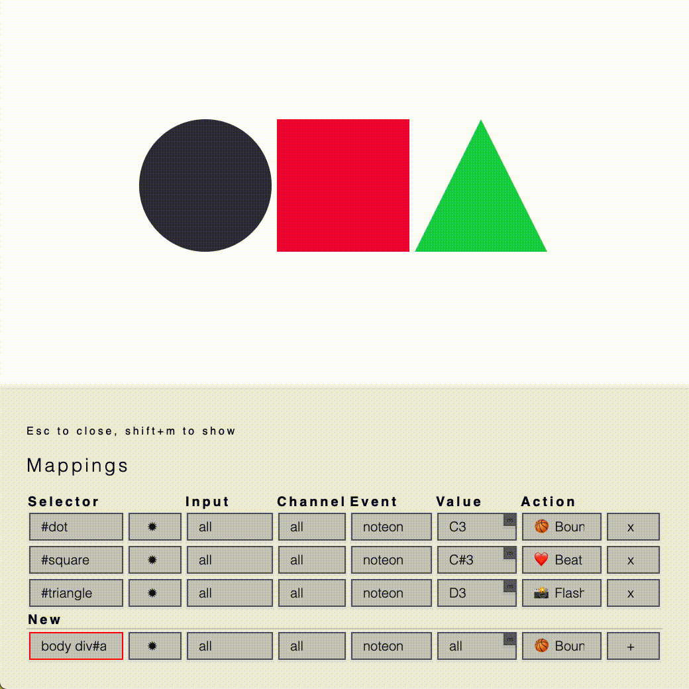

# WEBMIDI MAPPER

A silly Chrome extension to map DOM elements to incoming MIDI and apply various effects.

Add fun actions in actions.js.

## Made with the help of 
* Animate.css - https://github.com/daneden/animate.css 
* WebMidi.js - https://github.com/djipco/webmidi

## License 
MIT
